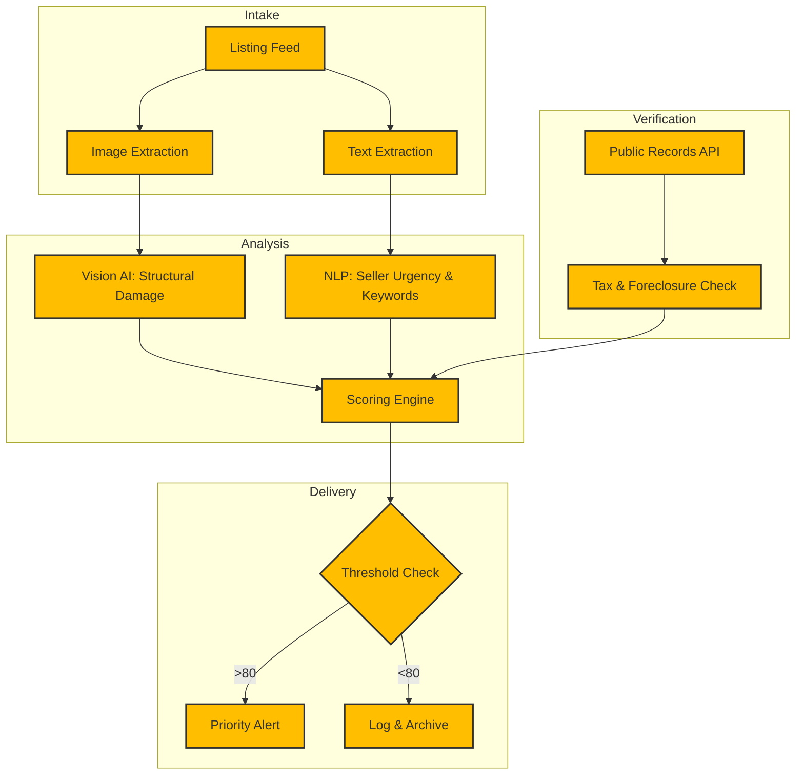

# Architecture — Distressed Property Detection

## Detailed System Flow

## Components

- **Listing Feed:** The entry point for all new market data, handling high-frequency updates from multiple sources.
- **Vision AI Damage Scan:** A specialized model trained to detect structural neglect, roof damage, and boarded-up windows from listing photos.
- **NLP Urgency Analysis:** Processes listing descriptions to find signals like "cash only," "must sell," or "as-is," which indicate seller distress.
- **Public Records Cross-check:** Validates tax delinquency and foreclosure filings to confirm financial distress.
- **Distress Score 0–100:** A composite metric that weighs physical, linguistic, and financial signals to rank deal quality.
- **Alerting Engine:** Distributes findings to the end-user via low-latency channels with built-in redundancy.

## Data Flow
1. **Ingestion:** Raw property data is pulled into the processing queue.
2. **Parallel Processing:** Images are sent to the Vision AI while text is analyzed by the NLP engine.
3. **External Lookup:** The system queries public records for the specific parcel ID.
4. **Synthesis:** All signals are combined into a weighted average score.
5. **Dispatch:** If the score exceeds the user-defined threshold, an alert is triggered immediately.

## Resilience & Compliance
- **Retry & Backoff:** The system uses exponential backoff for all third-party API calls to handle rate limits gracefully.
- **Audit Trail:** Every score calculation is logged with the contributing signals for transparency.
- **Isolation:** Processing for different regions is isolated to ensure horizontal scalability.

## Confidentiality
Please note that specific API endpoints, proprietary model weights, and database schemas are withheld to protect client intellectual property.
