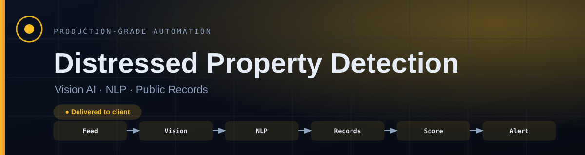
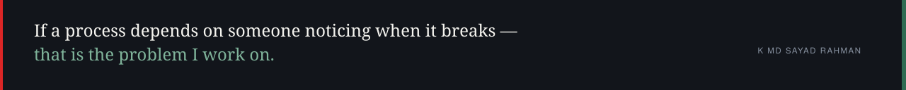

# Distressed Property Detection

**A qualifying listing is scored and alerted within minutes of going live, instead of found hours later after a competitor has already called.**

   

| | |
| :--- | :--- |
| **Built for** | US real estate investor |
| **Industry** | Real estate |
| **Status** | delivered to client |
| **Role** | Designed, built and deployed end to end |

---

### On this page

[The problem](#the-problem) · [What changed](#what-changed) · [How it works](#how-it-works) · [When it breaks](#when-it-breaks) · [The stack](#the-stack) · [Limitations](#honest-limitations) · [Read deeper](#read-deeper)

---

## The problem

An investor competing for distressed-property deals needed to know about a qualifying listing within minutes of it going live.

Hours later is not late by a little. By then a faster competitor has already made contact, and the deal is effectively gone. Speed was the entire requirement.

## What changed

| | Before | After |
| :--- | :--- | :--- |
| **Finding a listing** | Manual checking, whenever there is time | Pulled as it appears |
| **Assessing it** | Read the description, look at photos | Three signals scored into one number |
| **Time to contact** | Hours | Target under five minutes |
| **Missed listings** | Unknown | Every listing logged, scored or not |
| **A quiet feed** | Looks like no deals | Flagged as a possible fault |

Before/after describes the change in process, not benchmarked throughput. Where a number is not measured, it is not claimed.

## How it works

Listings are pulled as they appear. Photos are sent to an AI provider for a damage read, listing text is scanned for urgent-seller language, and public records are cross-checked for unpaid taxes or foreclosure status. The three signals combine into one 0–100 score, and a qualifying score alerts immediately.

<table>
<tr>
<td width="42" valign="top" align="center"><b>01</b></td><td valign="top"><b>A listing goes live</b> The feed is pulled continuously, not checked when someone has a moment.</td>
</tr>
<tr>
<td width="42" valign="top" align="center"><b>02</b></td><td valign="top"><b>Three questions at once</b> What do the photos show, what does the wording suggest, and what do the public records say.</td>
</tr>
<tr>
<td width="42" valign="top" align="center"><b>03</b></td><td valign="top"><b>One number comes out</b> The three signals combine into a single 0–100 score, so there is one thing to act on rather than three to weigh.</td>
</tr>
<tr>
<td width="42" valign="top" align="center"><b>04</b></td><td valign="top"><b>The phone rings fast</b> A qualifying score alerts within minutes. In this market that is the entire product.</td>
</tr>
<tr>
<td width="42" valign="top" align="center"><b>05</b></td><td valign="top"><b>Nothing is thrown away</b> Listings that do not qualify are still logged, so the threshold can be tuned against real history.</td>
</tr>
</table>

### How it flows

What happens to the client's work, in the order they experience it. The internal build — node graph, execution order, prompts, thresholds — is deliberately not published.

<b>What the shapes mean</b> — colour is not the only signal

| Shape | Means |
| :--- | :--- |
| **rounded** | Where the client's process starts |
| **box** | Something the system does |
| **diamond** | A decision point |
| **slanted** | A person has to act |
| **green box** | The good outcome |
| **red box** | Failure path — held, escalated or alerted |

Red appears in exactly one role across every repo in this portfolio: where failure goes. Nowhere else. If you see red, something is being held, escalated or alerted.

> **Walk it interactively** — [open the demo](https://mdsadrhoman123-stack.github.io/distressed-property-detection/) and press **Break it** to watch the failure path light up. Source: [`docs/index.html`](docs/index.html)

## When it breaks

Most automation portfolios show you the happy path. The happy path is the easy half. This is the half that decides whether a system survives contact with a real business.

| What goes wrong | How it is detected | What the system does | Who finds out |
| :--- | :--- | :--- | :--- |
| **Photo read fails or returns nothing** | Provider error or empty result | Score is built from the remaining signals and marked partial | Alert says the score is partial |
| **Public records lookup unavailable** | API error | Retry, then score without it rather than dropping the listing | Alert notes the missing signal |
| **Listing feed goes quiet** | No results across an expected window | Treated as a fault, not as “no good listings” | Alert — silence is suspicious |
| **Same listing appears twice** | Record check | Second occurrence does not re-alert | Nobody — by design |
| **Score sits just under the threshold** | Scoring logic | Logged rather than discarded, so the threshold can be reviewed | Visible in the log, not an alert |

The default on an unhandled condition is to **stop and tell someone** — never to continue on a guess. A silent success is the failure mode that costs the most, because nobody goes looking for it.

## The stack

| Component | Why this one |
| :--- | :--- |
| **n8n** | Orchestrates the three signal paths in one workflow |
| **AI vision API** | Listing photos are sent out for a visible-damage read — the provider does the seeing, not a model I trained |
| **AI text API** | Listing descriptions are read for urgent-seller language |
| **Public records API** | Unpaid taxes and foreclosure status |
| **Alerting** | Gets the investor on the phone first |

### Counted, not estimated

| | |
| :--- | :--- |
| Signals combined | **3** |
| Score range | **0–100** |
| Alert target | **under 5 minutes** |

These are counts from the built system — nodes, stages, versions, gates. No efficiency percentages are published here without a stated measurement method.

### Also worth knowing

- Being extended into a wider real-estate investor workflow by bundling it with the WhatsApp lead qualifier.

## Honest limitations

Every design decision costs something. These are the trade-offs in this build, stated by the person who made them.

- A photo read tells you what is visible in a photo. It is a signal, not a survey, and the score is explicitly a prioritisation aid rather than a valuation.
- Public records coverage varies by county. Where the lookup is thin the score leans on the other two signals, and says so.
- The qualifying threshold is a configured number. It needs reviewing against logged history rather than being set once.

## What is not in this repo

- **Client data.** None, in any form. Not anonymised, not sampled.
- **Credentials and endpoints.** Never committed. See [`NOTICE.md`](NOTICE.md).
- **The workflow itself.** No exports, no node graph, no execution order, no prompts, no scoring thresholds, no integration wiring — not sanitised, not partial, not in a screenshot. That is the build, and the build belongs to the engagement that paid for it.

This repository documents *how the problem was thought about* — the failure paths, the trade-offs, the reasoning. That is what tells you whether to hire someone. A copy of the wiring would not.

This is a portfolio repository documenting delivered work. It is not a product you can clone and run against your own accounts.

## Read deeper

| | |
| :--- | :--- |
| [01 · The problem](docs/01-problem.md) | The situation before, in full |
| [02 · The client journey](docs/02-journey.md) | Step by step, from their side |
| [03 · Architecture](docs/03-architecture.md) | Diagrams and the reasoning |
| [04 · Failure handling](docs/04-failure-handling.md) | Every path, and where it lands |
| [05 · The stack](docs/05-stack.md) | What was chosen and what was rejected |
| [06 · Results](docs/06-results.md) | What is measured and what is not |
| [07 · Limitations](docs/07-limitations.md) | The trade-offs, in detail |

---

### Tell me what the process is

I will tell you honestly whether automating it is worth your money — including when the answer is no.

**K MD SAYAD RAHMAN** — AI Automation Engineer  
n8n · AI agents · production reliability  
[LinkedIn](https://www.linkedin.com/in/khandokarsayad) · [More systems](https://github.com/mdsadrhoman123-stack)

