# 🏠 Real Estate Investors: Stop Losing Deals to Faster Competitors

 
 


**Client:** US Real Estate Investor · **Industry:** Real Estate · **Delivered by:** K MD SAYAD RAHMAN (Sayad.dev | AI Automation)

---

## 🎯 The Problem (In Your Words)

**"I'm losing distressed property deals because by the time I find out about a listing, someone faster has already made contact."**

Sound familiar? Here's what's happening:

- Manual listing checks every 2-4 hours = **opportunity gaps**
- Driving to properties without knowing true condition = **wasted time**  
- Competitors using AI while you're still manual = **losing deals**
- No systematic way to score property distress = **guessing games**

**The cost:** One missed deal = $10,000-$50,000 in lost profit.

---

## âš¡ The Result (What You'll Achieve)

| Metric | Before | After | Improvement |
|--------|--------|-------|-------------|
| **Deal Detection Speed** | 2-4 hours | **5 minutes** | **24x faster** |
| **Property Analysis Time** | 1-2 days | **30 seconds** | **Instant** |
| **Distress Prediction Accuracy** | Manual guess | **Data-driven** | **Multi-signal analysis** |
| **Competitive Response Time** | Late to every deal | **First to respond** | **Always first** |

---

## 🔄 Before vs After: The Workflow Difference

### BEFORE (Manual Process - Slow & Painful)
```
[Listing Appears Online] 
    ↓ (wait 2-4 hours)
[Manual Check: "Is this distressed?"] 
    ↓ (drive 30-60 mins)
[Visual Inspection: Property Condition] 
    ↓ (call agent, wait)
[Manual Research: Tax Records, Foreclosure Status] 
    ↓ (manual analysis)
[Guess: "Should I pursue this?"] 
    ↓
= **3-5 days to decision** ❌
```

### AFTER (Automated - Fast & Precise)
```
[Listing Appears Online] 
    ↓ (automated trigger, 30 seconds)
[Vision AI: Scans Photos for Damage] 
    ↓ (instant analysis)
[NLP: Analyzes Description for Urgent Language] 
    ↓ (parallel processing)
[Public Records: Checks Tax/Foreclosure Status] 
    ↓ (data integration)
[AI: Calculates 0-100 Distress Score] 
    ↓ (intelligent scoring)
[Alert: "Score 87/100 - Contact Now!"] 
    ↓
= **5 minutes to qualified decision** ✅
```

**The difference:** You're calling while competitors are still scrolling.

---

## 🏗️ How It Works (Conceptual Overview)

```mermaid
flowchart LR
    A["🏠 Listing Feed<br/>Real-time intake"] 
    B["🤖 Vision AI Damage Scan<br/>Photo analysis"]
    C["📝 NLP Description Analysis<br/>Language patterns"]
    D["📋 Public Records Check<br/>Tax & foreclosure data"]
    E["📊 Distress Scoring Engine<br/>0-100 score calculation"]
    F["🔔 Instant Alert System<br/><5 min notification"]
    
    A --> B
    A --> C
    A --> D
    B --> E
    C --> E
    D --> E
    E --> F
    
    style A fill:#3498db,color:#fff
    style E fill:#9b59b6,color:#fff
    style F fill:#2ecc71,color:#fff
```



**The System Intelligence:**
- **Vision AI** detects roof damage, structural issues, neglect signs from listing photos
- **NLP Engine** identifies seller urgency language: "motivated," "must sell," "as-is"
- **Records Integration** cross-checks unpaid taxes, foreclosure notices, liens
- **Scoring Algorithm** combines all signals into single 0-100 distress score
- **Smart Alerts** only notify when score exceeds your threshold (e.g., 75+)

---

## ✨ Key Features (What You Get)

| Feature | Benefit | Impact |
|---------|---------|--------|
| **🤖 Vision AI Analysis** | Automatic property damage detection | Save hours of manual inspection |
| **📝 NLP Language Processing** | Identify urgent seller language | Spot motivated sellers instantly |
| **📋 Public Records Integration** | Automatic tax/foreclosure checks | Complete picture in seconds |
| **📊 0-100 Distress Scoring** | Single number decision metric | Clear, data-driven decisions |
| **🔔 <5 Minute Alerts** | Beat competitors to every deal | First mover advantage |
| **🎯 Custom Thresholds** | Set your minimum score preferences | Focus on deals that matter |
| **📱 Multi-Channel Alerts** | Email, SMS, Telegram notifications | Never miss a qualified deal |

---

## 🎬 See It In Action

### Live Dashboard Preview (Demo with Dummy Data)

```
┌─────────────────────────────────────────────────────────────┐
│  🏠 REAL ESTATE AI AUTOMATION SYSTEM - LIVE DASHBOARD       │
├─────────────────────────────────────────────────────────────┤
│                                                              │
│  🔴 NEW ALERT: 123 Oak Street, Austin TX                    │
│  ┌─────────────────────────────────────────────────────────┐  │
│  │ Score: 87/100  │  Time: 4 min ago  │  Action: Call Now │  │
│  └─────────────────────────────────────────────────────────┘  │
│                                                              │
│  📊 TODAY'S PERFORMANCE:                                     │
│  • Listings Scanned: 47                                     │
│  • Qualified Alerts: 3                                      │
│  • Average Response Time: 4.2 minutes                      │
│                                                              │
│  🏗️ PROPERTY ANALYSIS EXAMPLE:                              │
│  ┌─────────────────────────────────────────────────────────┐  │
│  │ Vision AI: Roof damage detected (confidence: 92%)       │  │
│  │ NLP: "motivated seller" pattern found                   │  │
│  │ Records: $2,400 unpaid taxes (2023)                     │  │
│  │ Final Score: 87/100 - HIGH DISTRESS                     │  │
│  └─────────────────────────────────────────────────────────┘  │
│                                                              │
└─────────────────────────────────────────────────────────────┘
```

*(Note: Real client data removed for confidentiality. Demo shows system capabilities.)*

---

## 🛠️ Automation Technology Stack

**Core Engine:** n8n Workflow Automation  
**AI Integration:** Vision AI, Natural Language Processing  
**Data Sources:** Public Records APIs, Listing Feeds  
**Alerting System:** Production-grade notification engine  
**System Type:** Real Estate AI Automation System

---

## 🧠 Engineering Philosophy

**"Automations Fail Silently — I Engineer Systems That Don't"**

This system includes:
- **Explicit Error Handling:** No silent failures, every error triggers an alarm
- **Retry Logic with Backoff:** Temporary issues don't mean permanent failures  
- **Audit Trails:** Every action logged for compliance and debugging
- **Human-in-the-Loop:** AI handles 80%, humans make critical 20% decisions
- **Production-Grade Reliability:** Built for real business use, not prototypes

---

## 🚀 What's Next (Roadmap)

- [ ] **v2.0:** Multi-market expansion (Miami, Austin, Denver)
- [ ] **Mobile Push Notifications:** Instant alerts on your phone
- [ ] **CRM Integration:** Direct export to your existing system
- [ ] **Predictive Scoring:** Historical data for even better accuracy
- [ ] **Competitor Analysis:** Know who else is viewing the same properties

---

## 🔒 What I'm Not Publishing

For client confidentiality and IP protection, I've deliberately omitted:

- Actual workflow JSON files (node configurations, business logic)
- AI model prompts and system instructions  
- API integration patterns and authentication methods
- Database schemas with real field structures
- Client-specific business rules and thresholds
- Production deployment configurations

**This is a real client system. Want something similar for your business? Let's talk.**

---

## 📞 Hire Me For Similar Projects

**K MD SAYAD RAHMAN** — Sayad.dev | AI Automation

**📧 Work Email:** khandokarsayad@gmail.com  
**📧 Personal Email:** mdsadrhoman123@gmail.com  
**💼 LinkedIn:** https://linkedin.com/in/khandokarsabbir  
**🐙 GitHub:** https://github.com/mdsadrhoman123-stack

**🚀 Open to Work — Accepting New Automation Projects**

**📩 Email me with your automation challenge — I'll tell you exactly 
which part I'd automate first, and which part I wouldn't.**

---

## 🔄 See My Other Automation Systems

- [🏥 Healthcare Document Automation](../medical-document-automation) - Medical records processing
- [☀️ Solar CRM Automation](../irish-solar-crm) - Field service business systems  
- [📊 E-commerce Review Automation](../review-outreach-pipeline) - Customer review generation
- [🏢 Enterprise Intake Automation](../flowdesk) - Client request processing systems

---

<div align="center">

**Built by K MD SAYAD RAHMAN (Sayad.dev | AI Automation)**

**📧 Contact:** khandokarsayad@gmail.com | mdsadrhoman123@gmail.com

Copyright (c) 2024 K MD SAYAD RAHMAN. All rights reserved. Portfolio use only.

*[n8n](https://n8n.io) · [Vision AI](https://openai.com) · [Real Estate Automation](https://linkedin.com/in/khandokarsabbir)*

</div>