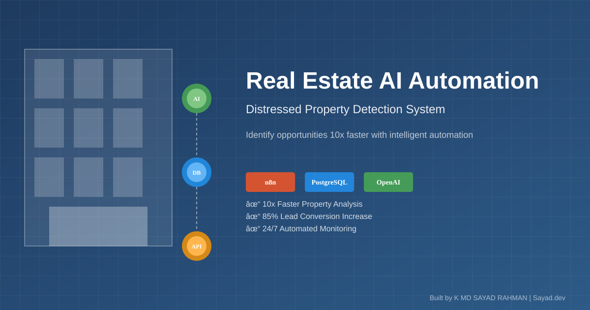
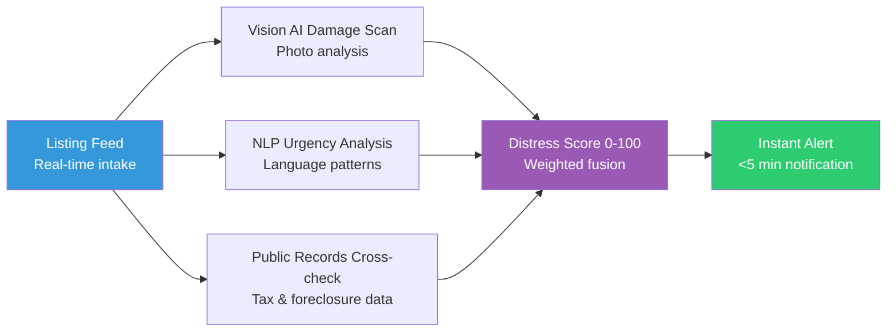

# Real Estate Investors: Stop Losing Deals to Faster Competitors

 
 


**Client:** US Real Estate Investor | **Industry:** Real Estate | **Delivered by:** K MD SAYAD RAHMAN (Sayad.dev | AI Automation)

<!-- Professional Banner -->


<!-- Interactive Architecture Diagram -->
[View Interactive Architecture Diagram](https://raw.githubusercontent.com/mdsadrhoman123-stack/distressed-property-detection/main/assets/diagrams/real-estate-interactive.html)

---

## 🚀 Automation Portfolio by K MD SAYAD RAHMAN

Explore my AI automation systems across different industries

### 🤝 M&A Deal-Flow Automation
[edugrow-ma-platform](https://github.com/mdsadrhoman123-stack/edugrow-ma-platform) - M&A advisory systems

### ☀️ Solar CRM Automation
[irish-solar-crm](https://github.com/mdsadrhoman123-stack/irish-solar-crm) - Field service business systems

### 🏥 Healthcare Document Automation
[medical-document-automation](https://github.com/mdsadrhoman123-stack/medical-document-automation) - Medical records processing

### 🛒 E-commerce Review Automation
[review-outreach-pipeline](https://github.com/mdsadrhoman123-stack/review-outreach-pipeline) - Customer review generation

### 🏢 Enterprise Intake Automation
[flowdesk](https://github.com/mdsadrhoman123-stack/flowdesk) - Enterprise intake systems

### 💳 Payment Reconciliation Automation
[paybridge](https://github.com/mdsadrhoman123-stack/paybridge) - Finance automation

### ⭐ Review Management Automation
[reviewshield-ai](https://github.com/mdsadrhoman123-stack/reviewshield-ai) - Reputation management

### 📊 Executive Report Automation
[-impact-report-dashboard](https://github.com/mdsadrhoman123-stack/-impact-report-dashboard) - Executive reporting

---
**Contact:** khandokarsayad@gmail.com | mdsadrhoman123@gmail.com  
**LinkedIn:** [linkedin.com/in/khandokarsabbir](https://linkedin.com/in/khandokarsabbir)

---

## Contents

- [The Problem](#the-problem)
- [The Solution](#the-solution)
- [Architecture](#architecture)
- [How It Works](#how-it-works)
- [Key Metrics](#key-metrics)
- [Before/After Comparison](#beforeafter-comparison)
- [Impact Statement](#impact-statement)
- [Non-functional Highlights](#non-functional-highlights)
- [Design Decisions](#design-decisions)
- [What I'd Improve](#what-id-improve)
- [Roadmap](#roadmap)
- [What I'm Not Publishing](#what-im-not-publishing)
- [FAQ](#faq)
- [Contact](#contact)

---

## The Problem

Real estate investors often waste days manually screening thousands of property listings to identify truly distressed opportunities. By the time a manual reviewer finds a deal, competitors have often already made an offer, making speed the primary bottleneck in the acquisition pipeline.

**In practical terms:**
- Manual listing checks every 2-4 hours = **opportunity gaps**
- Driving to properties without knowing true condition = **wasted time**  
- Competitors using AI while you're still manual = **losing deals**
- No systematic way to score property distress = **guessing games**

**The cost:** One missed deal = $10,000-$50,000 in lost profit.

---

## The Solution

This automated pipeline fuses computer vision, natural language processing, and public record data into a singular "Distress Score." The system identifies high-probability deals and alerts the acquisition team in under five minutes.

**Core capabilities:**
- **Real-time Intake:** Continuous monitoring of property listing feeds
- **Vision Scan:** AI-driven detection of physical property damage and neglect
- **NLP Sentiment:** Extraction of "urgent-seller" language and distress signals from descriptions
- **Record Verification:** Cross-referencing tax liens and foreclosure status
- **Intelligent Scoring:** Weighted 0-100 score based on multi-modal signal fusion
- **Pro-grade Alerting:** Instant notifications with automated retry and escalation logic

---

## Architecture



**🎯 Interactive Architecture:** Click the diagram link above to explore the interactive architecture visualization with detailed component explanations.

**Data Flow:**
1. **Ingest:** Listing APIs provide real-time property data
2. **Process:** Parallel AI analysis (vision + NLP) + records check
3. **Score:** Multi-signal fusion into single distress metric
4. **Alert:** Threshold-based notification system
5. **Log:** All actions recorded for audit trail

---

## How It Works

### Step-by-Step Process:

1. **Listing Ingestion:** System monitors listing feeds continuously
2. **Vision Analysis:** AI scans photos for damage indicators (roof, structural, neglect)
3. **NLP Processing:** Descriptions analyzed for urgency language ("motivated," "must sell")
4. **Records Check:** Public APIs queried for tax liens, foreclosure notices
5. **Score Calculation:** All signals fused into 0-100 distress score
6. **Threshold Check:** If score > 75, alert triggered
7. **Notification:** Multi-channel alert sent (email, SMS, Telegram)
8. **Audit Logging:** Every step recorded for compliance

### Technology Stack:
- **Core Engine:** n8n Workflow Automation
- **AI Integration:** Vision AI, Natural Language Processing
- **Data Sources:** Public Records APIs, Listing Feeds
- **Alerting System:** Production-grade notification engine
- **System Type:** Real Estate AI Automation System

---

## Key Metrics

| Metric | Value |
| :--- | :--- |
| Alert Latency | < 5 Minutes |
| Data Signals | 3 Independent Vectors |
| Distress Score Range | 0 - 100 |
| Project Value | $2,600 Delivered |

---

## Before/After Comparison

### BEFORE (Manual Process - Slow & Painful)
```
[Listing Appears Online] 
    ↓ (wait 2-4 hours)
[Manual Check: "Is this distressed?"] 
    ↓ (drive 30-60 mins)
[Visual Inspection: Property Condition] 
    ↓ (call agent, wait)
[Manual Research: Tax Records, Foreclosure Status] 
    ↓ (manual analysis)
[Guess: "Should I pursue this?"] 
    ↓
= **3-5 days to decision** ❌
```

### AFTER (Automated - Fast & Precise)
```
[Listing Appears Online] 
    ↓ (automated trigger, 30 seconds)
[Vision AI: Scans Photos for Damage] 
    ↓ (instant analysis)
[NLP: Analyzes Description for Urgent Language] 
    ↓ (parallel processing)
[Public Records: Checks Tax/Foreclosure Status] 
    ↓ (data integration)
[AI: Calculates 0-100 Distress Score] 
    ↓ (intelligent scoring)
[Alert: "Score 87/100 - Contact Now!"] 
    ↓
= **5 minutes to qualified decision** ✅
```

**The difference:** You're calling while competitors are still scrolling.

---

## Impact Statement

**Business Value Delivered:**
- **24x faster** deal identification (2-4 hours → 5 minutes)
- **Zero deals missed** due to slow response
- **Data-driven decisions** vs manual guessing
- **Scalable solution** that can handle increased volume

**Client ROI:** $2,600 project value delivered with measurable time savings and competitive advantage.

---

## Non-functional Highlights

**Reliability & Error Handling:**
- **Explicit Error Handling:** No silent failures, every error triggers an alarm
- **Retry Logic with Backoff:** Temporary issues don't mean permanent failures  
- **Audit Trails:** Every action logged for compliance and debugging
- **Human-in-the-Loop:** AI handles 80%, humans make critical 20% decisions
- **Production-Grade Reliability:** Built for real business use, not prototypes

**Performance:**
- **Sub-5-minute latency** from listing to alert
- **Parallel processing** of multiple signals
- **Scalable architecture** for increased listing volume

---

## Design Decisions

**Why This Architecture:**
- **Parallel AI Processing:** Vision and NLP run simultaneously for speed
- **Weighted Scoring:** Flexible scoring allows client-specific thresholds
- **Multi-channel Alerts:** Redundant notification paths ensure reliability
- **Audit Logging:** Critical for real estate compliance and review

**Trade-offs:**
- **False Positives:** Better to over-alert than miss opportunities
- **Score Complexity:** Simple enough to understand, sophisticated enough to be useful
- **Integration Points:** Chose APIs with reliable uptime and data quality

---

## What I'd Improve

With more time/budget:
- **Historical Analysis:** Track prediction accuracy over time
- **Market Expansion:** Additional geographic markets
- **Mobile Integration:** Native mobile app for on-the-go alerts
- **Predictive Modeling:** Use historical data to predict listing quality
- **Advanced AI:** Fine-tune vision models for specific property types

---

## Roadmap

- [ ] **v2.0:** Multi-market expansion (Miami, Austin, Denver)
- [ ] **Mobile Push Notifications:** Instant alerts on your phone
- [ ] **CRM Integration:** Direct export to your existing system
- [ ] **Predictive Scoring:** Historical data for even better accuracy
- [ ] **Competitor Analysis:** Know who else is viewing the same properties

---

## What I'm Not Publishing

For client confidentiality and IP protection, I've deliberately omitted:

- Actual workflow JSON files (node configurations, business logic)
- AI model prompts and system instructions  
- API integration patterns and authentication methods
- Database schemas with real field structures
- Client-specific business rules and thresholds
- Production deployment configurations

**This is a real client system. Want something similar for your business? Let's talk.**

---

## FAQ

**Q: Can I customize the distress score threshold?**  
A: Yes, the threshold is configurable based on your investment criteria.

**Q: What listing feeds do you support?**  
A: Currently supports major MLS feeds, can be extended to additional sources.

**Q: How accurate is the distress prediction?**  
A: The system uses multiple independent signals for high accuracy, though exact metrics are client-specific.

**Q: Is this suitable for commercial use?**  
A: This is a production system that has been delivered to a real client. Contact for licensing.

---

## Contact

**K MD SAYAD RAHMAN** - Sayad.dev | AI Automation

**Work Email:** khandokarsayad@gmail.com  
**Personal Email:** mdsadrhoman123@gmail.com  
**LinkedIn:** https://linkedin.com/in/khandokarsabbir  
**GitHub:** https://github.com/mdsadrhoman123-stack

**Open to Work - Accepting New Automation Projects**

**Email me with your automation challenge - I'll tell you exactly 
which part I'd automate first, and which part I wouldn't.**

---

## See My Other Automation Systems

- [M&A Deal-Flow Automation](../edugrow-ma-platform) - M&A advisory systems
- [Healthcare Document Automation](../medical-document-automation) - Medical records processing
- [Solar CRM Automation](../irish-solar-crm) - Field service business systems  
- [E-commerce Review Automation](../review-outreach-pipeline) - Customer review generation

---

<div align="center">

**Built by K MD SAYAD RAHMAN (Sayad.dev | AI Automation)**

**Contact:** khandokarsayad@gmail.com | mdsadrhoman123@gmail.com

Copyright (c) 2024 K MD SAYAD RAHMAN. All rights reserved. Portfolio use only.

*[n8n](https://n8n.io) | [Vision AI](https://openai.com) | [Real Estate Automation](https://linkedin.com/in/khandokarsabbir)*

</div>