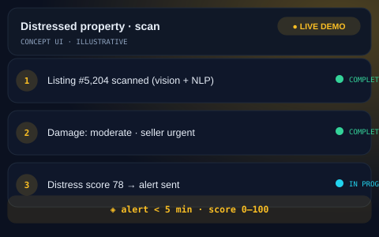

# 🏠 Distressed Property Detection — Real Estate Investor OS

## The Problem
Real estate investors often waste days manually screening thousands of property listings to identify truly distressed opportunities. By the time a manual reviewer finds a deal, competitors have often already made an offer, making speed the primary bottleneck in the acquisition pipeline.

## The Solution
This automated pipeline fuses computer vision, natural language processing, and public record data into a singular "Distress Score." The system identifies high-probability deals and alerts the acquisition team in under five minutes.

- **Real-time Intake:** Continuous monitoring of property listing feeds.
- **Vision Scan:** AI-driven detection of physical property damage and neglect.
- **NLP Sentiment:** Extraction of "urgent-seller" language and distress signals from descriptions.
- **Record Verification:** Cross-referencing tax liens and foreclosure status.
- **Intelligent Scoring:** Weighted 0–100 score based on multi-modal signal fusion.
- **Pro-grade Alerting:** Instant notifications with automated retry and escalation logic.

## Architecture at a Glance

## Key Metrics
| Metric | Value |
| :--- | :--- |
| Alert Latency | < 5 Minutes |
| Data Signals | 3 Independent Vectors |
| Distress Score Range | 0 – 100 |

## What Was Built
- [x] Real-time listing monitoring engine.
- [x] Vision AI module for automated physical damage assessment.
- [x] NLP urgency classifier for seller descriptions.
- [x] Public records integration (tax and foreclosure API).
- [x] Weighted scoring algorithm and instant alerting system with escalation.

## Deliberately Not Published
- [ ] 🔒 Production credentials and private API keys.
- [ ] 🔒 Proprietary scoring weights and signal thresholds.
- [ ] 🔒 Client deal data and live listing history.

This repository is a portfolio presentation. No proprietary workflows, source code, or client data are published — by design.

## See It in Action

> Illustrative concept UI — a visual walkthrough of the workflow. Not a production screenshot.

## Tech Stack
- Vision AI
- Natural Language Processing (NLP)
- Public Records APIs
- Production-grade Alerting Systems

---
[Architecture Deep-Dive](ARCHITECTURE.md) · [Case Study](CASE-STUDY.md)

**Built by Sabbir — AI Automation Engineer**  
*Production-grade automation, not templates*
