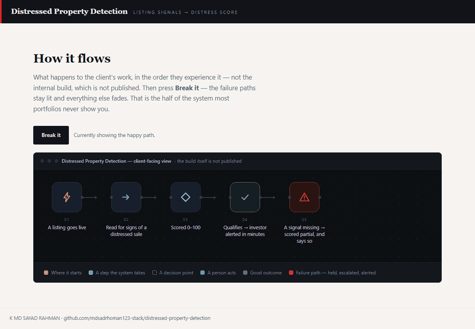
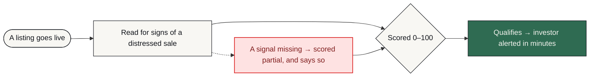

# Distressed Property Detection

**A qualifying listing is scored and alerted within minutes of going live, instead of found hours later after a competitor has already called.**

     [](https://github.com/mdsadrhoman123-stack/distressed-property-detection/actions/workflows/honesty-check.yml)



**The system in five seconds, then the same system failing on purpose.** The second half is the half most portfolios leave out. That is a recording of [`docs/index.html`](docs/index.html) in this repository — one file, no build step, no network — with the **Break it** button actually pressed, not illustrated.

> [!NOTE]
> **What this is.** A production-grade system built to a brief that businesses in this sector post publicly, in their own words — the problem exactly as they stated it, not one invented to demonstrate something. It was engineered the way anything a business actually depends on has to be: the failure paths designed before the features, every one of them logged and alerted rather than left to chance. It runs on my own infrastructure. It is ready to deploy for any business with this problem, and it has not been sold or deployed into a customer's business yet.

| | |
| :--- | :--- |
| **Built for** | US real-estate investors |
| **The brief** | The problem exactly as businesses in this sector post it — public job briefs on Upwork and Fiverr, in their words, not my framing |
| **Industry** | Real estate |
| **Status** | running on my own n8n |
| **Failure paths designed** | 5 — each with how it is detected, what the system does about it, and who finds out |
| **My role** | Sole engineer — scoping, architecture, build, failure design and operation |
| **Availability** | Ready to deploy for any business with this problem — built once as a product, not as a one-off. Running on my own infrastructure; not sold yet. |

---

### On this page

[The problem](#the-problem) · [What changed](#what-changed) · [How it works](#how-it-works) · [The shape of it](#the-shape-of-the-system) · [When it breaks](#when-it-breaks) · [Why this way](#why-it-is-built-this-way) · [Limitations](#honest-limitations) · [What is here](#what-is-in-this-repository) · [Read deeper](#read-deeper)

---

## The problem

An investor competing for distressed-property deals needed to know about a qualifying listing within minutes of it going live.

Hours later is not late by a little. By then a faster competitor has already made contact, and the deal is effectively gone. Speed was the entire requirement.

## What changed

| | Before | After |
| :--- | :--- | :--- |
| **Finding a listing** | Manual checking, whenever there is time | Pulled as it appears |
| **Assessing it** | Read the description, look at photos | Three signals scored into one number |
| **Time to contact** | Hours | Target under five minutes |
| **Missed listings** | Unknown | Every listing logged, scored or not |
| **A quiet feed** | Looks like no deals | Flagged as a possible fault |

<sub>Before/after describes the change in process, not benchmarked throughput. Where a number is not measured, it is not claimed.</sub>

## How it works

Listings are pulled as they appear. Photos are sent to an AI provider for a damage read, listing text is scanned for urgent-seller language, and public records are cross-checked for unpaid taxes or foreclosure status. The three signals combine into one 0–100 score, and a qualifying score alerts immediately.

<table>
<tr>
<td width="42" valign="top" align="center"><b>01</b></td><td valign="top"><b>A listing goes live</b><br>The feed is pulled continuously, not checked when someone has a moment.</td>
</tr>
<tr>
<td width="42" valign="top" align="center"><b>02</b></td><td valign="top"><b>Three questions at once</b><br>What do the photos show, what does the wording suggest, and what do the public records say.</td>
</tr>
<tr>
<td width="42" valign="top" align="center"><b>03</b></td><td valign="top"><b>One number comes out</b><br>The three signals combine into a single 0–100 score, so there is one thing to act on rather than three to weigh.</td>
</tr>
<tr>
<td width="42" valign="top" align="center"><b>04</b></td><td valign="top"><b>The phone rings fast</b><br>A qualifying score alerts within minutes. In this market that is the entire product.</td>
</tr>
<tr>
<td width="42" valign="top" align="center"><b>05</b></td><td valign="top"><b>Nothing is thrown away</b><br>Listings that do not qualify are still logged, so the threshold can be tuned against real history.</td>
</tr>
</table>

### How it flows

<sub>What happens to the client's work, in the order they experience it. The internal build — node graph, execution order, prompts, thresholds — is deliberately not published.</sub>



<details>
<summary><b>What the shapes mean</b> — colour is not the only signal</summary>

| Shape | Means |
| :--- | :--- |
| **rounded** | Where the client's process starts |
| **box** | Something the system does |
| **diamond** | A decision point |
| **slanted** | A person has to act |
| **green box** | The good outcome |
| **red box** | Failure path — held, escalated or alerted |

Red appears in exactly one role across every repo in this portfolio: where failure goes. Nowhere else. If you see red, something is being held, escalated or alerted.
</details>

> **Walk it interactively** — [`docs/index.html`](docs/index.html) is a single self-contained page. Download it, open it in any browser, and press **Break it** to watch the failure path light up. Nothing to install, no network calls.

## The shape of the system

Parts and the role each one plays. Not the wiring — no execution order, no prompt text, no thresholds. That is a deliberate line, and the last branch of the tree names exactly what sits on the other side of it.

```text
Distressed Property Detection — the running system
│
├── Interfaces ...................... the systems it talks to
│   └── Public records API .......... Unpaid taxes and foreclosure status
│
├── Judgement ....................... where a decision or a piece of writing is made
│   ├── AI vision API ............... Listing photos are sent out for a visible-damage read — the provider does the seeing, not a model I trained
│   └── AI text API ................. Listing descriptions are read for urgent-seller language
│
├── Oversight ....................... how a human stays in the loop
│   └── Alerting .................... Gets the investor on the phone first
│
├── Ground .......................... what the whole thing runs on
│   └── n8n ......................... Orchestrates the three signal paths in one workflow
│
├── Failure design .................. 5 paths, designed before the features
│   ├── detected by ................. an error output, a timer, or a failed connection
│   ├── handled by .................. falling back, holding, or halting — never guessing
│   └── announced to ................ a named person, with the reason attached
│
└── Not in this repository .......... the part that would let you skip the thinking
    ├── the node graph .............. which part runs after which, and on what condition
    ├── the prompts ................. wording, guardrails, the shape of the output
    ├── the thresholds .............. what counts as urgent, late, at capacity, a match
    └── the credentials ............. never committed, in any form, at any point
```

Read it as a set of decisions rather than a parts list. Every part is there because a specific failure or a specific constraint put it there, and the two sections below are the same story told twice: **When it breaks** is what each part is defending against, and **Honest limitations** is what it costs to have chosen that part and not another.

### Counted, not estimated

| | |
| :--- | :--- |
| Signals combined | **3** |
| Score range | **0–100** |
| Alert target | **under 5 minutes** |

<sub>These are counts from the built system — nodes, stages, versions, gates. No efficiency percentages are published here without a stated measurement method.</sub>

### Also worth knowing

- Being extended into a wider real-estate investor workflow by bundling it with the WhatsApp lead qualifier.

## When it breaks

Most automation portfolios show you the happy path. The happy path is the easy half. This is the half that decides whether a system survives contact with a real business.

| What goes wrong | How it is detected | What the system does | Who finds out |
| :--- | :--- | :--- | :--- |
| **Photo read fails or returns nothing** | Provider error or empty result | Score is built from the remaining signals and marked partial | Alert says the score is partial |
| **Public records lookup unavailable** | API error | Retry, then score without it rather than dropping the listing | Alert notes the missing signal |
| **Listing feed goes quiet** | No results across an expected window | Treated as a fault, not as “no good listings” | Alert — silence is suspicious |
| **Same listing appears twice** | Record check | Second occurrence does not re-alert | Nobody — by design |
| **Score sits just under the threshold** | Scoring logic | Logged rather than discarded, so the threshold can be reviewed | Visible in the log, not an alert |

The default on an unhandled condition is to **stop and tell someone** — never to continue on a guess. A silent success is the failure mode that costs the most, because nobody goes looking for it.

## Why it is built this way

Three decisions, each with the option that was turned down and the price of turning it down. A choice with no cost attached to it was not a choice — it was a default, and defaults are not worth reading about.

<details open>
<summary><b>Why three signals collapse into one score</b></summary>

**What it does.** A damage read from the photos, urgent-seller language in the listing text, and public records for tax and foreclosure status — combined into a single 0–100 number.

**What was turned down.** Any one signal on its own. Each is cheap and each is noisy: a badly lit photo is not distress, and urgent wording is sometimes just marketing.

**What that costs.** Public records coverage varies by county. Where the lookup is thin the score leans on the other two signals, and the alert says so rather than hiding it.

</details>

<details>
<summary><b>Why the seeing is bought rather than trained</b></summary>

**What it does.** Listing photos go to a vision provider. The provider does the seeing; there is no model here that I trained.

**What was turned down.** Training a damage model. Better fit in principle — and it needs a labelled dataset that does not exist, plus someone to keep it labelled as the market changes.

**What that costs.** A cost per image and a dependency on someone else's model. And a photo read tells you what is visible in a photo: it is a signal for prioritising a call, not a survey.

</details>

<details>
<summary><b>Why the qualifying threshold is configuration</b></summary>

**What it does.** The score that triggers an alert is a set value, meant to be reviewed against the history the system has logged.

**What was turned down.** A fixed number in the build. One less thing to manage — and it silently stops matching reality as a market moves, while continuing to look authoritative.

**What that costs.** Somebody has to review it. A threshold nobody revisits is a threshold that is quietly wrong.

</details>

Every cost above also appears in **Honest limitations** below. It is there twice on purpose: once as the reasoning, once as the consequence, so neither can be quietly dropped from the other.

## Honest limitations

Every design decision costs something. These are the trade-offs in this build, stated by the person who made them.

- A photo read tells you what is visible in a photo. It is a signal, not a survey, and the score is explicitly a prioritisation aid rather than a valuation.
- Public records coverage varies by county. Where the lookup is thin the score leans on the other two signals, and says so.
- The qualifying threshold is a configured number. It needs reviewing against logged history rather than being set once.

## What is in this repository

Every file, and the question it answers. Same layout in all eleven repositories in this portfolio, so the second one you open needs no orientation at all.

```text
distressed-property-detection/
├── README.md ....................... ← you are here
├── SECURITY.md ..................... how to report something that should not be public
├── NOTICE.md ....................... what is withheld, and why
├── LICENSE ......................... covers the documentation, not a software grant
│
├── docs/ ........................... the long form — read in order or not at all
│   ├── index.html .................. the interactive demo, one file, no network
│   ├── 01-problem.md ............... the situation before, in full
│   ├── 02-journey.md ............... step by step, from their side
│   ├── 03-architecture.md .......... the diagrams, and why they are shaped that way
│   ├── 04-failure-handling.md ...... every failure path, and where it lands
│   ├── 05-stack.md ................. each choice, the option turned down, the cost
│   ├── 06-results.md ............... what is measured, and what is deliberately not
│   └── 07-limitations.md ........... the trade-offs, in detail
│
├── diagrams/ ....................... source, so the flow can be re-rendered
│   ├── pipeline-lr.mmd ............. the client-level flow, left to right
│   └── pipeline-tb.mmd ............. the same flow, top to bottom
│
├── assets/ ......................... local files only — nothing from a CDN
│   ├── banner.svg .................. the header on this page
│   ├── demo.gif .................... the recording at the top of this page
│   └── cta.svg ..................... the closing card
│
├── workflows/ ...................... empty on purpose — see below
│   └── README.md ................... why it is empty, in writing
│
└── .github/ ........................ the badge at the top of this page
    ├── honesty-check.py ............ the claim linter it runs
    └── workflows/
        └── honesty-check.yml ....... runs it on every push
```

There is no `src/` in that tree, and no `workflows/*.json`. That is not an omission — it is the design, and the next section says exactly what is being withheld and why.

## What is not in this repo

- **Data belonging to a real business.** None, in any form. Not anonymised, not sampled — there never was any.
- **Credentials and endpoints.** Never committed. See [`NOTICE.md`](NOTICE.md) for what is withheld, and [`SECURITY.md`](SECURITY.md) for how to report anything that slipped through.
- **The workflow itself.** No exports, no node graph, no execution order, no prompts, no scoring thresholds, no integration wiring — not sanitised, not partial, not in a screenshot. That is the build, and the build is not portfolio material.

This repository documents *how the problem was thought about* — the failure paths, the trade-offs, the reasoning. That is what tells you whether to hire someone. A copy of the wiring would not.

This is a portfolio repository documenting a system I designed and built. It is not a product you can clone and run against your own accounts.

## Read deeper

| | |
| :--- | :--- |
| [01 · The problem](docs/01-problem.md) | The situation before, in full |
| [02 · The journey](docs/02-journey.md) | Step by step, from their side |
| [03 · Architecture](docs/03-architecture.md) | Diagrams and the reasoning |
| [04 · Failure handling](docs/04-failure-handling.md) | Every path, and where it lands |
| [05 · The stack](docs/05-stack.md) | What was chosen and what was rejected |
| [06 · Results](docs/06-results.md) | What is measured and what is not |
| [07 · Limitations](docs/07-limitations.md) | The trade-offs, in detail |

---


### Tell me what the process is

I will tell you honestly whether automating it is worth your money — including when the answer is no.

**K MD SAYAD RAHMAN** — AI Automation Engineer  
n8n · AI agents · production reliability  
[khandokarsayad@gmail.com](mailto:khandokarsayad@gmail.com) · [mdsadrhoman123@gmail.com](mailto:mdsadrhoman123@gmail.com) · [LinkedIn](https://www.linkedin.com/in/khandokarsayad) · [More systems](https://github.com/mdsadrhoman123-stack)

